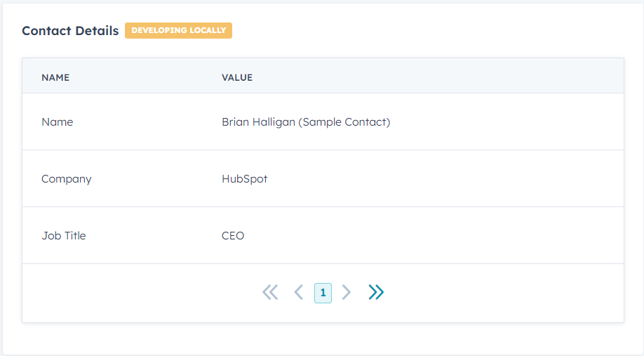

# Contact Details Card

This card displays contact details by fetching information from properties in HubSpot CRM.



## Installation

To install this HubSpot CRM extension, you can use npm. Run the following command:
```bash
npm install
```

## Usage

- Deploy this extension within your HubSpot environment.
- The card will retrieve and display contact details from the HubSpot CRM, including Name, Company, and Job Title.

## CLI Commands

You can refer to the [HubSpot Project CLI Commands](https://developers.hubspot.com/docs/platform/project-cli-commands) documentation for more information on using CLI commands for your HubSpot projects.

## Author

devadigax

